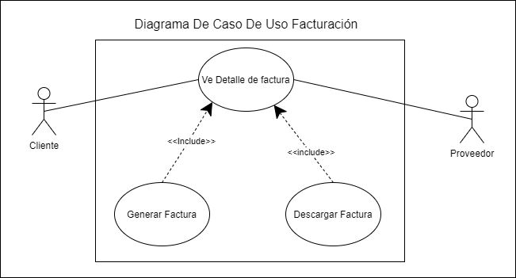

Universidad de San Carlos de Guatemala  
Facultad de Ingeniería  
Escuela de Ciencias y Sistemas  
Software Avanzado       
Sección O

  

  

_____

## **Grupo 4**

| Integrante | Carnet |
| -- | -- |
| German Salguero  | 201114496 |
| Marellyn Lisbeth Trejo Castro | 201313688 | 
| Carlos Rene Orantes Lara | 201314172 |

  

_____

# Documentacion Proyecto 1

## Aplicacion a desarrollar

Se realiza el desarrollo de una aplicacion que permita realizar un flujo de compras en linea.
Se basara en la facilidad de poder desarrollar las conecciones entre los proveedores y clientes, servicios que podran tener una interraccion entre la informacion proporcionada por los proveedores y las opciones que se les pueden ofrecer a los clientes a traves de un catalogo, en el cual los usuarios puedan verificar la informacion e imagenes detalladas de cada producto y tengan la oportundiad de agregar a un carrito de compras los productos y cantidad de los mismos, tomando en consideracion las opciones como disponibilidad en stack. 
Se centra en que se completara un servicio de ventas que su objetivo y prioridad es reducir costos, proporcionar al usuario una experiencia agradable y que en la cual no tenga que salir de su casa.

Cuenta con varias pantallas, entre las cuales se encuentran las funcionalidades basicas que serian registros y el ABC completo para clientes y productos. Tambien se cuentan con las pantallas donde se visualizar cada producto, informacion escencial, imagenes, cantidad, etc. Por otro lado se encuentra la pantalla donde se permite realizar y dar por finalizada la compra.

## Versionamiento del documento

Para el versionamiento del proyecto se estara utilizando la herramienta de Github. Se creo un repositorio que seria "SA_Poyecto2021".
En este se trabajo mediante las siguientes ramas :

    - feature/testing: Rama en la cual se realizan las purebas, entre ellas validaciones de dependencias, inicios de sesion.
    
    - feature/micro-cart : Rama en la cual se realiza la inicializacion del microservicio para la autenticacion de clientes, se definen controladores y rutas funcionales, se realiza la configuracion de envio y verificacion de token. Se realiza los modelos y conexiones a la BD
    
    - feature/DB_clientes: Rama en la que se crea modelo/tabla y conexion de la base de datos para los clientes. Tambien se realizan validaciones de inserciones y consutlas.
    
    - feature/auth_clientes: Rama en la que se realiza la validaciones, modelos, controladores, rutas y la configuracion de envio y verificacion de token para los clientes.
    
    - feature/micro-producto: Rama en la que se encuentra los modulos, modelos, rutas de productos.
    
    - feature/frontend_home : Rama en la que se traba el abc de productos, pagina de inicio.
    
    - feature/frontend_producto : Rama en la que se encuentra la interfaz, serian los perfiles, creacion, abc productos.
    
    - develop : Integracion de todos los procesos validados con anterioridad.

Para validar y realizar el versionamiento del proyecto se ralizan tres Tags a lo largo del desarrollo, estos son generados estrategicamente para llevar una continuidad funcional y en caso de problemas con despliegues que contentan fallas.

## Lenguaje de programación

Los lenguajes de programacion utilizados son los detallados acontinuacion:

    - Node JS v. 12.18.3
    
    - cors v. 2.8.5
    
    - express v 4.17.1
    
    - jsonwebtoken v. 8.5.1
    
    - mongoose v. 5.13.7

## Herramientas de desarrollo
    - Jenkins
    
    - Docker
    
    - Ansible
    
    - free tier
    
    - AWS
    
        - EC2
	
        - S3

## Metodología

Se implementara el modelo incremental ya que este modelo permite a nuestro modelo de negocio avanzar de una forma mas efectivas por los avances que se pueden realizar sin completar por complento una funcionalidad y asi avanzar en varias tareas al mismo tiempo. Este modelo tambien nos permitara realizar la implemetancion de los feature, que serian las mejoras y actualizaciones de cada servicio en el que se este trabajando. Por lo que se trabajaran en simultaneo los roles de los clientes y proveedores, para luego continuar con los servicios de carritos, los cuales necesitan basarse en los registros proporcionados por clietnes proveedor, sin embargo no dependen que los servicios se encuentren terminados.

## Requerimientos funcionales 
 * El usuario debe poder logearse y registrarse por medio de su correo.
 * El cliente debe poder agregar, modificar y eliminar productos del carrito de compras.
 * El cliente debe poder consultar el listado de productos actuales en el carrito de compras.
 * El cliente debe poder comprar y confirmar compras con tarjetas de crédito y/o débito.
 * El cliente debe recibir notificaciones a su correo electrónico de cada compra.
 * Los proveedores deben recibir notificaciones por cada compra de sus productos.
 * El cliente debe poder consultar su perfil y hacer modificaciones de foto de su rostro.
 * Los proveedores deben poder visualizar sus productos de venta.
 * Los proveedores deben ser capaces de agregar y eliminar sus productos del catálogo. 

## Requerimientos no funcionales
 * El sistema debe estar disponible en un 99% conforme al año, 365 días.
 * Las peticiones se realizan mediante el estándar de JWT (JSON Web Token).
 * El sistema contará con un sistema de roles, el cual limitará las funcionalidades de cada usuario.
 * La tasa de errores cometidos por el usuario deberá ser menor del 1% de las transacciones totales ejecutadas en el sistema.
 * El sistema debe proporcionar mensajes de error que sean informativos y orientados al usuario final.
 * La aplicación web debe poseer un diseño “Responsive” a fin de garantizar la adecuada visualización en múltiples computadores personales, dispositivos tablets y teléfonos inteligentes.

## Arquitectura del sistema

## Microservicios

## Caso de uso

## Diagrama de secuencia

## Infraestructura como Código

### Environment
    
    Por medio de este archivo, se prepara el entorno para desplegar los microservicios en producción. Estos microservicios se ejecutan en contenedores, por lo cual se hace la instalación de docker.

    hosts: production // hace referencia a los host registrados como producción
  remote_user: gm_ye //usuario con el que se conectará
 
  tasks:
  - name: Copiar archivo instalación docker
	copy: //bloque que permite copiar el archivo de instalación
    	src: ./install-docker.sh
    	dest: ~/
    	mode: '766' // se agregan los permisos de ejecución
  - name: Instalar docker
	become: yes // se ejecuta como superusuario
	shell: ./install-docker.sh //ejecutar script

### Deploy

Por medio de este archivo se copia el docker-compose.yml a la máquina de producción, se hace un pull de todas las imágenes utilizadas y posteriormente se reconstruyen los contenedores.

hosts: production
  remote_user: gm_ye
 
  tasks:
  - name: copy docker compose
	copy:
  	src: ./docker-compose.yml
  	dest: ~/
  - name: docker compose pull
	shell: docker-compose pull
  - name: start all with docker-compose
	shell: docker-compose up --build -d

## Install-docker.sh

## Docker
sudo apt install apt-transport-https ca-certificates curl software-properties-common -y
curl -fsSL https://download.docker.com/linux/ubuntu/gpg | sudo apt-key add -
sudo add-apt-repository "deb [arch=amd64] https://download.docker.com/linux/ubuntu bionic stable"
sudo apt update -y
sudo apt-cache policy docker-ce -y
sudo apt install docker-ce -y
 
## Docker Compose
sudo curl -L "https://github.com/docker/compose/releases/download/1.26.2/docker-compose-$(uname -s)-$(uname -m)" -o /usr/local/bin/docker-compose
sudo chmod +x /usr/local/bin/docker-compose
sudo ln -s /usr/local/bin/docker-compose /usr/bin/docker-compose
docker-compose --version
sudo chmod 666 /var/run/docker.sock
## docker sin sudo
sudo usermod -aG docker ${USER}
#sudo su
#exit
 
### Docker Compose de Producción
Por medio de este archivo, se realiza la construcción de los contenedores de microservicios y se mapean los puertos.

/**instalacion de node/
    	environment:
        	- mongo_connection_string=”ruta de mondo”
    	image: garciaem/iclient_service:latest
        container_name: client-service
    	ports:
    	- 3000:3000
	crxexxacion_de_servicio:
    	image: /*se crea la imagen*/
    	container_name: /*se agrega la siguiente imagen*/
    	ports:
    	- 3001:3100
	admin_service:
    	image: garciaem/iadmin_service:latest
    	container_name: admin-service
    	ports:
    	- 3002:3000

# Fase 2

## EndPoints 
| Tipo  | Produt                                    |
| ----- | ------------------------------------------|
|GET    | http://35.192.90.40:3000/api/product       |
|POST   | http://35.192.90.40:3000/api/product       | 
|UPDATE | http://35.192.90.40:3000/api/product/:id   |
|DELETE | http://35.192.90.40:3000/api/product/:id   |

  

| Tipo  | Categories                                 |
| ----- | ------------------------------------------ |
|GET    | http://35.192.90.40:3000/api/category       |
|POST   | http://35.192.90.40:3000/api/category       | 
|UPDATE | http://35.192.90.40:3000/api/category/:id   |
|DELETE | http://35.192.90.40:3000/api/category/:id   |

  

| Tipo  | cart                                      |
| ----- | ------------------------------------------|
|POST   | http://35.192.90.40:3001/api/cart          | 
|UPDATE | http://35.192.90.40:3001/api/cart/:id      |
|DELETE | http://35.192.90.40:3001/api/cart/:id      |

  

| Tipo  | Order                                      |
| ----- | ------------------------------------------ |
|GET    | http://35.192.90.40:3001/api/order          |
|POST   | http://35.192.90.40:3001/api/order          | 
|UPDATE | http://35.192.90.40:3001/api/order/:id      |
|DELETE | http://35.192.90.40:3001/api/order/:id      |

  

| Tipo  | users consumers                            |
| ----- | ------------------------------------------ |
|POST   | http://35.192.90.40:4000/login              |
|POST   | http://35.192.90.40:4000/verify             | 
|POST   | http://35.192.90.40:4000/signup             |
|POST   | http://35.192.90.40:4000/notify             |

  

| Tipo  | users consumers                            |
| ----- | ------------------------------------------ |
|POST   | http://35.192.90.40:4001/login              |
|POST   | http://35.192.90.40:4001/verify             | 
|POST   | http://35.192.90.40:4001/signup             |
|POST   | http://35.192.90.40:4001/notify             |

  

| Tipo  | users consumers                            |
| ----- | ------------------------------------------ |
|GET 	  |http://35.192.90.40:4080/auctions	     |
|GET 	  |http://35.192.90.40:4080/auction	     |
|POST 	|http://35.192.90.40:4080/auction	     |
|UPDATE |http://35.192.90.40:4080/auction	     | 
|DELETE |http://35.192.90.40:4080/auction      |

## Factura

### Diagrama de Actividad

### Diagrama de Caso de Uso

### Diagrama de Clases

### Diagrama de Flujo

